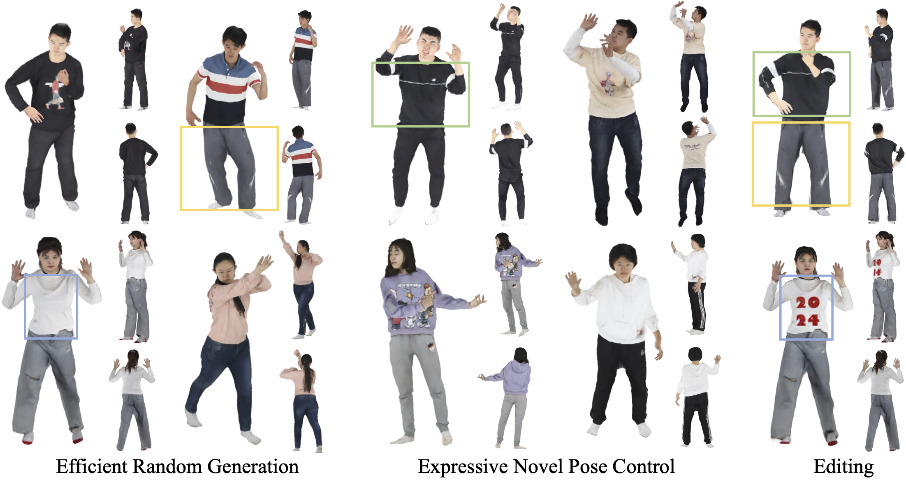

# E<sup>3</sup>Gen: Efficient, Expressive and Editable Avatars Generation
## [Paper](https://dl.acm.org/doi/10.1145/3664647.3681409) | [Arxiv](http://arxiv.org/abs/2405.19203) | [Project Page](https://olivia23333.github.io/E3Gen/)

 

Official PyTorch implementation of paper: [*E<sup>3</sup>Gen: Efficient, Expressive and Editable Avatars Generation*](http://arxiv.org/abs/2405.19203).

<span style="font-size: 10px;">Our new work [Disentangled Clothed Avatar Generation with Layered Representation](https://olivia23333.github.io/LayerAvatar/) is currently on Arxiv, code is coming soon.</span>

## Getting Started

### Prerequisites

The code has been tested in the environment described as follows:

- Linux (tested on Ubuntu 20.04 LTS)
- Python 3.7
- [CUDA Toolkit](https://developer.nvidia.com/cuda-toolkit-archive) 11.3
- [PyTorch](https://pytorch.org/get-started/previous-versions/) 1.12.1
- [MMCV](https://github.com/open-mmlab/mmcv) 1.6.0
- [MMGeneration](https://github.com/open-mmlab/mmgeneration) 0.7.2

### Installation
1. Set up a conda environment as follows:
```bash
# Export the PATH of CUDA toolkit
export PATH=/usr/local/cuda-11.3/bin:$PATH
export LD_LIBRARY_PATH=/usr/local/cuda-11.3/lib64:$LD_LIBRARY_PATH

# Create conda environment
conda create -y -n e3gen python=3.7
conda activate e3gen

# Install PyTorch (this script is for CUDA 11.3)
pip install torch==1.12.1+cu113 torchvision==0.13.1+cu113 --extra-index-url https://download.pytorch.org/whl/cu113

# Install MMCV and MMGeneration
pip install -U openmim
mim install mmcv-full==1.6
git clone https://github.com/open-mmlab/mmgeneration && cd mmgeneration && git checkout v0.7.2
pip install -v -e .
cd ..

# Clone this repo and install other dependencies
git clone <this repo> && cd <repo folder>
pip install -r requirements.txt

# Install gaussian-splatting
git clone https://github.com/graphdeco-inria/gaussian-splatting --recursive
cd gaussian-splatting/submodules/diff-gaussian-rasterization
python setup.py develop
cd ../simple-knn
python setup.py develop
cd ../../../

# Install dependencies for deformation module
python setup.py develop

# Install pytorch3d
wget https://anaconda.org/pytorch3d/pytorch3d/0.7.1/download/linux-64/pytorch3d-0.7.1-py37_cu113_pyt1121.tar.bz2
conda install --use-local pytorch3d-0.7.1-py37_cu113_pyt1121.tar.bz2
```

2. Download the SMPLX model and related files for avatar representation template and gaussian initialization.

**(Recommend) You can run the following command to automatically download all these files.**

*Before running, please remember to register on the [SMPL-X website](https://smpl-x.is.tue.mpg.de) and [FLAME website](http://flame.is.tue.mpg.de/).*
```bash
bash scripts/fetch_template.sh 
```

After downloading, the structure should look like this:
```
.
├── assets
├── ...
├── lib
│   ├── models
│       ├── deformers
│           ├── smplx
│               ├── SMPLX
│                   ├── models
│                       ├── smplx
│                           ├── SMPLX_FEMALE.npz
│                           ├── SMPLX_FEMALE.pkl
│                           ├── SMPLX_MALE.npz
│                           ├── SMPLX_MALE.pkl
│                           ├── SMPLX_NEUTRAL.npz
│                           ├── SMPLX_NEUTRAL.pkl
│                           ├── smplx_npz.zip
│                           └── version.txt
└── work_dirs
    ├── cache
        ├── template
            ├── FLAME_masks.pkl
            ├── head_template_mesh_mouth.obj
            ├── head_template.obj
            ├── SMPL-X__FLAME_vertex_ids.npy
            ├── smplx_uv.obj
            └── smplx_vert_segmentation.json
```

(You can also download them manually and place them in the correct folders.

Put the following files in the `work_dirs/cache/template` folder.
- [SMPL-X segmentation file](https://github.com/Meshcapade/wiki/blob/main/assets/SMPL_body_segmentation/smplx/smplx_vert_segmentation.json)(smplx_vert_segmentation.json)
- [SMPL-X UV](https://download.is.tue.mpg.de/download.php?domain=smplx&sfile=smplx_uv.zip)(smplx_uv.obj)
- [SMPL-X FLAME Correspondence](https://download.is.tue.mpg.de/download.php?domain=smplx&sfile=smplx_mano_flame_correspondences.zip)(SMPL-X__FLAME_vertex_ids.npy)
- [FLAME with mouth Mesh Template](https://github.com/philgras/neural-head-avatars/blob/main/assets/flame/head_template_mesh_mouth.obj)(head_template_mesh_mouth.obj)
- [FLAME Mesh Template](https://github.com/yfeng95/DECA/blob/master/data/head_template.obj)(head_template.obj)
- [FLAME Mask](https://files.is.tue.mpg.de/tbolkart/FLAME/FLAME_masks.zip)(FLAME_masks.pkl)

Put the [SMPL-X model](https://smpl-x.is.tue.mpg.de) (models_smplx_v1_1.zip) in `lib/models/deformers/smplx/SMPLX/`)

3. Extract avatar representation template from downloaded files:
```bash
cd lib/models/deformers

# preprocess for uv, obtain new uv for smplx_mouth.obj
python preprocess_smplx.py

# save subdivide smplx mesh and corresponding uv
python subdivide_smplx.py

# save parameters for init
python utils_smplx.py
python utils_uvpos.py
```

4. (**Optional**, for training and local editing process)Download the [Pretrained VGG](https://drive.google.com/file/d/1x1Kc41DqolkNve70I_OCsiyamrPuNB1b/view?usp=sharing) for perceptual loss calculation, and put the files to `work_dirs/cache/vgg16.pt`.

## Data preparation

1. Download [THUman2.0 Dataset](https://github.com/ytrock/THuman2.0-Dataset) and its corresponding SMPL-X fitting parameters from [here](https://drive.google.com/file/d/1rnkGomScq3yxyM9auA-oHW6m_OJ5mlGL/view?usp=sharing).
Unzip them to `./data/THuman`.

2. Render the RGB image with [ICON](https://github.com/YuliangXiu/ICON).

We made some modifications to the ICON rendering part, so please install our version:
```bash
git clone https://github.com/olivia23333/ICON

cd ICON
git checkout e3gen
conda create -n icon python=3.8
conda activate icon
conda install pytorch==1.12.1 torchvision==0.13.1 cudatoolkit=11.3 -c pytorch
conda install -c fvcore -c iopath -c conda-forge fvcore iopath
conda install -c bottler -c conda-forge nvidiacub pyembree
conda install pytorch3d -c pytorch3d
pip install -r requirements.txt --use-deprecated=legacy-resolver
git clone https://github.com/YuliangXiu/rembg
cd rembg 
pip install -e .
cd ..

bash fetch_data.sh
```

After the installation, run
```bash
# rendering 54 views for each scan
bash scripts/render_thuman.sh
```

If `scripts/render_thuman.sh` is stuck at the `mesh.ray.intersects_any` function, you can refer to [this issue](https://github.com/YuliangXiu/ICON/issues/62).

Finally, run the following commands:
```bash
cd ..
# change rendered images into training dataset format
python reorganize.py
python split.py

# generate test cache, we use configs/ssdnerf_avatar_uncond_thuman_conv_16bit.py here
conda deactivate
conda activate e3gen
CUDA_VISIBLE_DEVICES=0 python tools/inception_stat.py /PATH/TO/CONFIG
```

The final structure of the training dataset is as follows:
```
data
└── humanscan_wbg
    ├── human_train
        ├── 0000
            ├── pose    # camera parameter
            ├── rgb     # rendered images
            ├── smplx   # smplx parameter
        ├── ...
        ├── 0525
    ├── human_test
    └── human_train_cache.pkl
```

## Training

Run the following command to train a model:

```bash
# For /PATH/TO/CONFIG, we use configs/ssdnerf_avatar_uncond_thuman_conv_16bit.py here
python train.py /PATH/TO/CONFIG --gpu-ids 0 1
```
Our model is trained using 2 RTX 3090 (24G) GPUs.

Model checkpoints will be saved into `./work_dirs`. UV features plane for scans will be saved into `./cache`.

## Inference
```bash
# For /PATH/TO/CONFIG, we use configs/ssdnerf_avatar_uncond_thuman_conv_16bit.py here
python test.py /PATH/TO/CONFIG /PATH/TO/CHECKPOINT --gpu-ids 0 1 

# For novel view synthesis (We provide 36 novel views)
python test.py /PATH/TO/CONFIG /PATH/TO/CHECKPOINT --gpu-ids 0 1 --mode 'viz'

# For animation (We use the motion file from the AMASS dataset, if you want to run this code, please download the CMU data from the AMASS dataset and put it in ./demo/ani_exp/ani_file)
python test.py /PATH/TO/CONFIG /PATH/TO/CHECKPOINT --gpu-ids 0 1 --mode 'animate'

# For attribute transfer(upper cloth and pants)
python test.py /PATH/TO/CONFIG /PATH/TO/CHECKPOINT --gpu-ids 0 1 --mode 'transfer'

# For local texture editing
python test.py /PATH/TO/CONFIG /PATH/TO/CHECKPOINT --gpu-ids 0 1 --mode 'edit'
```
The trained model can be downloaded from [here](https://drive.google.com/file/d/1bklHperCiTS-_KXDusIre1zq8GL-ulW2/view?usp=sharing) for testing.
Example `.pth` files can be download from [here](https://drive.google.com/file/d/1EXBueuArrSDpZ95lGd8TOztCYZ_cUSxA/view?usp=share_link) for `transfer` and `edit` mode.

Codes for editing and novel pose animation will be updated soon.

## Acknowledgements
This project is built upon many amazing works: 
- [SSDNeRF](https://github.com/Lakonik/SSDNeRF) for Base Diffusion Backbone
- [gaussian-splatting](https://github.com/graphdeco-inria/gaussian-splatting)
- [AG3D](https://github.com/zj-dong/AG3D) for deformation module
- [ICON](https://github.com/YuliangXiu/ICON), [NHA](https://github.com/philgras/neural-head-avatars), [MVP](https://github.com/facebookresearch/mvp), [TADA](https://github.com/TingtingLiao/TADA),
[DECA](https://github.com/yfeng95/DECA) and [PointAvatar](https://github.com/zhengyuf/PointAvatar) for data preprocessing
- [StyleGAN2-ADA](https://github.com/NVlabs/stylegan2-ada-pytorch) for perceptual loss

## Citation
```
@inproceedings{zhang2024e3gen,
    author = {Zhang, Weitian and Yan, Yichao and Liu, Yunhui and Sheng, Xingdong and Yang, Xiaokang},
    title = {E3Gen: Efficient, Expressive and Editable Avatars Generation},
    year = {2024},
    booktitle = {Proceedings of the 32nd ACM International Conference on Multimedia},
    pages = {6860–6869},
    numpages = {10},
    series = {MM '24}
}
```
